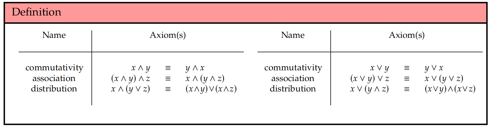
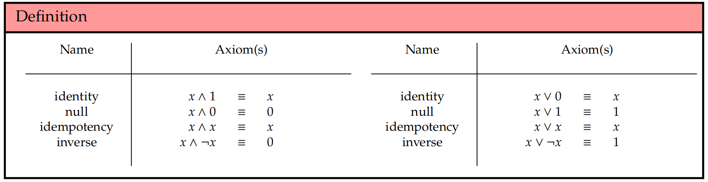
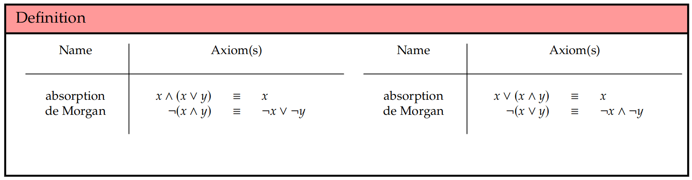
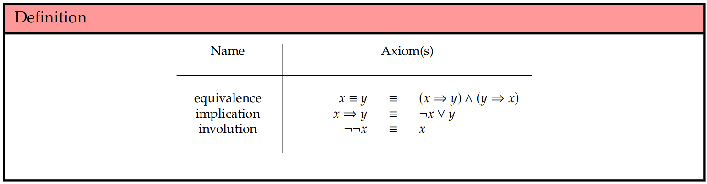
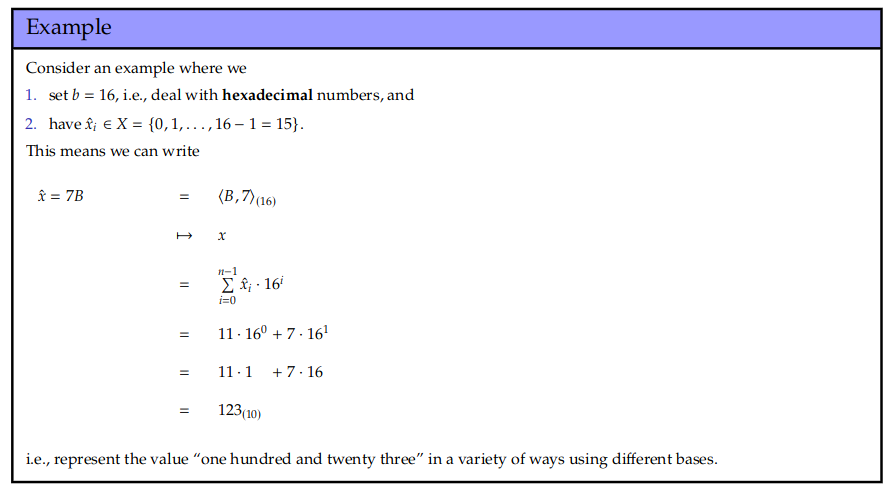
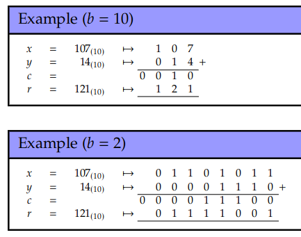
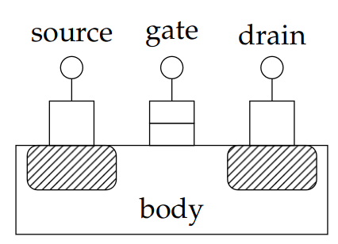
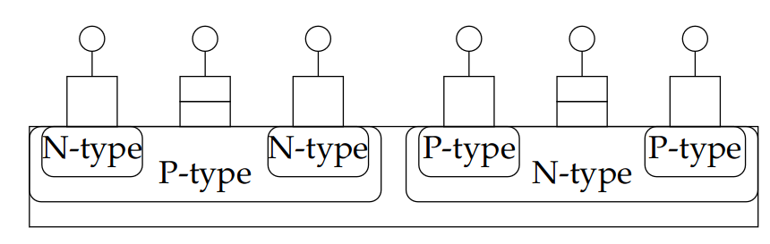

# Overview

# 00 - Intro

- From electronics to how it is used by people and software
- electronics → logic gates → e.g. ALU → CPU → FDE → ISA → programs
- how computers can be used more effectively / efficiently
- abstraction as a coping mechanism for complexity
- ISA is the line between hardware & software; interface
- Formative: (wk6 wk12), (wk18, wk24) – reading & revision weeks
- summative: (wk10 30%), (assessment period 70%)
- after reading week -1 lecture & optional Labs, more relaxed
- coursework deadline wk10
  - available now, but meant to start wk7
  - not just hardware oriented, e.g. how to write better software

# 01.1 propositional logic

propositions are basically statements e.g. 
_"the temperature is 20°C"_

1. can be evaluated ~~"theis statement is false"~~
2. must be unambiguous ~~"the temperature is too hot"~~
3. can include free variables "the temperature is $x$°C"
4. can be represented using a short-hand variable or function: f = ... or g(x) = ...

## Conectives can combine statements

- NOT $\neg$
- AND $\land$
- NAND $\overline\land$ (universal / functionaly complete)
- OR $\lor$
- NOR $\overline\lor$ (universal / functionaly complete)
<!-- - XOR $\oplus$ (derived)
- XNOR $\overline\oplus$ (derived) -->

- implication $\Rightarrow$
- equivalence $\equiv$ (XNOR)

## Data-flow Diagram

very similar to the mathematical tree approach

## Truth Tables

|$x$|$y$|$x \oplus y$|
|-|-|-|
|F|F|F|
|F|T|T|
|T|F|T|
|T|T|F|

- usefull as a lookup table

- or use it as a specification

- it can be helpfull to ad intermediates to truth tables

# 01.2 Boolean Algebra

$x \lor \text{false} \equiv x$

$x \land \text{true} \equiv x$

AND, OR, NOT are _native_ operators

XOR, NAND, NOR, XNOR are _derived_ operators

## Rules

1. $ \mathbb{B} = \{0, 1\} $
2. shorten every statement to either a _variable_ or _function_
3. use _unary operators_ and _binary operators_ to form expressions
4. manimulate expressions according to axioms

## New Truth Tables

|$x$|$y$|$x \oplus y$|
|-|-|-|
|0|0|0|
|0|1|1|
|1|0|1|
|1|1|0|

## Axioms

## Practical Use-Cases

- simplifying complex statements

### Simplification methods

**SoP:**
- make minterms and $\lor$ together
- disjunctive normal form

**PoS**
- make maxterms and $\land$ togeter
- conjunctive normal form

### Electronic Design AUtomation (EDA)

- manipulation
- translation
- simulation
- verification

### truth tables

- using 'don't care' values
- don't care $\not=$ don't know

- as an input it can remove rows in the table

- as an output it can simplify other logic; help optimise

# 02.1 Integer Representation

we can think of integars as a sequance
123 ≡ ⟨3, 2, 1⟩

so we can think of binary bytes as a sequence of bytes
01111011 ≡ ⟨1, 1, 0, 1, 1, 1, 1, 0⟩

- bit: 0 or 1
- byte: 8 bits
- word: $w$ number of bits
  - fixed for each processor, 32 bit CPU = 4 bytes / word

these bit sequences can represent _anything_

$\hat X \mapsto X\\\equiv\\$
the representation of X maps to the value of X

the representation is a sequance of bits, and the value could be anything

- mappings must yield the correct value _and_ be consistent (in both directions)

## Endianess

1. little-endian
$\hat X_{LE} = ⟨X_0, X_1, X_2, X_3, X_4, X_5, X_6 ⟩ = ⟨1, 1, 0, 1, 1, 1, 1⟩$.

2. big-endian
$X_{BE} = ⟨X_6, X_5, X_4, X_3, X_2, X_1, X_0 ⟩ = ⟨1, 1, 1, 1, 0, 1, 1⟩.$

## Useful properties

> Overloading: using the same underlying structure for multiple different types of data

- overload $⊘ ∈ \{¬\}$

  $R = ⊘X$

  $R_i = ⊘X_i$

- Overload $⊖ ∈ \{∧, ∨, ⊕\}$

  $R = X ⊖ Y$

  $R_i = X_i ⊖ Y_i$

assume we pad the shorter one with zeros if they have different lengths

## Hamming Properties

- Hamming weigth: the number of times $X_i = 1$

  HW(X) = $\sum\limits_{i=0}^{n-1}{X_i}$

- Hamming distance: the number of bits that differ, the number of times $X_i \not = X_i$

  HD(X) = $\sum\limits_{i=0}^{n-1}{X_i \oplus Y_i }$ = HW ($X \oplus Y$)

## Positional number systems

a prositional number system expresses the value of a number $x$ using a base-$b$ (or radix-$b$) expansion

$\hat x = ⟨\hat x_0, \hat x_1, ..., \hat x_{n−1}⟩$

$\mapsto$

$\pm \sum\limits_{i=0}^{n-1}{\hat x_i \cdot b^i }$
- each digit is 'weighted' by some power of the base

- you need b-1 symbols, so letters are used (A, B, C, ...) when b > 10

## Example

### Base 10

$b =  10$

$\hat x_i ∈ X = \{0, 1, ..., 10 − 1 = 9\}$

$x = 123\quad = ⟨3, 2, 1⟩_{(10)}$

$\quad\quad\quad\quad\quad \mapsto x$

$\quad\quad\quad\quad\quad = \pm \sum\limits_{i=0}^{n-1}{\hat x_i \cdot 10^i }$

$\quad\quad\quad\quad\quad = 3 · 10^0 + 2 · 10^1 + 1 · 10^2$

$\quad\quad\quad\quad\quad = 3 · 1 + 2 · 10 + 1 · 100$

$\quad\quad\quad\quad\quad = 321_{(10)}$

### Base 2

### Hexadecimal

## Standard integars

we need to represent elements of $\mathbb Z$, but
1. its an infinete set
2. it has negative numbers

### Solution - from C

$\text{unsigned char} ≃ \text{uint8\_t} \mapsto \{ 0, ..., +2^8 − 1 \}$

$\text{char} ≃ \text{int8\_t} \mapsto \{ −2^7 , ..., 0, ..., +2^7 − 1 \}$

## Sign

### Sign & Magnitude

- problem: there is a positive and negative zero

### 2s Complement

- problem: asymetric limits

## Take Away Points

1. We control what bit sequences mean
  - an (un)singed 8-bit int
  - a generic object which can take 2^8 states

  and, therefore, anything
  - a pixel in an image
  - a character in a document
  - a number in a matrix
  - ...
2.
  beyond this knowing various standerd representations is usefull

# 02.2 Integer Arithmatic

$\hat x \mapsto x$

$\hat y \mapsto y$

$f(\hat x, \hat y) = \hat r \mapsto r = x+y$

$f:\{0,1\}^n \times \{0,1\}^n \rightarrow \{0,1\}^{n+1}$

where f has an action on $\hat x$ and $\hat y$ compatible with that of $+$ on $x$ and $y$

accepts 2 n bit number and produces an (n+1)-bit sum $\hat r$

$f$ must:
1. function correctly
2. satisfies pertinent quality metrics (efficient in time / space)

## Addition

### algorithm

1. $r \leftarrow 0, c_0 \leftarrow ci$
2. $\textbf{for}\ i=0\ \textbf{upto}\ n-1\ \textbf{step}\ +1 do$
3. $\;\big|\; r_i \leftarrow (x_i + y_i + c_i)\ \text{mod}\ b$
4. $\;\big|\; \textbf{if}\ (x_i + y_i + c_i)\ \textbf{then}\ c_{i+1} \leftarrow 0\ \textbf{else}\ c_{i+1} \leftarrow 1$
5. $\textbf{end}$
6. $co \leftarrow c_n$
7. $\textbf{return}\ r, co$

$f_i:\{0,1\}^3 \rightarrow \{0,1\}^2$

full adder truth table
$ci$|$x$|$y$||$co$|$s$
-|-|-|-|-|-
0|0|0||0|0
0|0|1||0|1
0|1|0||0|1
0|1|1||1|0
1|0|0||0|1
1|0|1||1|0
1|1|0||1|0
1|1|1||1|1

- this is a symetric expression

by unrolling the loop in the algorithm, a simple circuit can be produced:

this is a ripple carry adder, the carry out of each individual adder is chained into the next one

However, 
- the magnitude of $x+y$ can exceed what we can represent via $\hat r$
  - if $\hat x$ and $\hat y$ are _unsigned_ and there is a carry out $\Rightarrow$ **carry** condition
  - if $\hat x$ and $\hat y$ are _signed_ and the sign of $\hat r$ is incorrect $\Rightarrow$ **overflow** condition

- to fix this, typically:
  1. detect the problem
  2. take corrective action (try to fix it if possible)
      - the result could be truncated
      - clamp or saturate the result to the largest magnitude representable in n bits
  3. signal the condition somehow (e.g. status register or exception)

conditions for overflow:
- x +ve y -ve       ⇒ no overflow
- x -ve y +ve       ⇒ no overflow
- x +ve y +ve r +ve ⇒ no overflow
- x +ve y +ve r -ve ⇒    overflow
- x -ve y -ve r +ve ⇒    overflow
- x -ve y -ve r -ve ⇒ no overflow

# 02.3 Transistors & Logic gates

Micro-electronic switches (transistors) must be
- small
- fast
- reliable
- useable - packaged into higher level blocks
- manufacturble

The most detail we go into is "transistors are just switches"

## Semiconductors

- Atoms are made of
  1. a group of nucleons, either protons or neutrons, called the nucleus
  2. a cloud of electrons arranged in _shells_
      - each shell can hold $2n^2$ electrons
      - any difference in number of electrons and total capacity are called _holes_

- the binding between particles can be disrupted
  - if an electron absorbs enough energy, it becomes so excited it will be displaced and becomes _free_
  - free electrons can move between shells or atoms, 'attracted' to holes

- Current is a flow of electrons
  - free electrons 'move' from low to high potential
  - a material can be either conductive or insulating (low or high resistivity)

- Si is very useful because
  1. it's highly abundant
  2. it can be _doped_ by adding different elements
      - P / As $\rightarrow$ extra electrons
      - B / Al $\rightarrow$ extra holes
  3. it's fairly inert, so it won't degrade or go wierd over time

  - this results in a sime-conductor
    - **N-type** = extra electrons 
    - **P-type** = extra holes
    - by making a 'sandwich' you can make a switch

Historically the switches were vacuum tubes
- relatively reliable
- failed on power on / off

Replaced with transistors relitively quickly for their size
- many types
  - 1925: Field Effect Transistor (FET).
  - 1953: Junction FET (or JFET).
  - 1959: Metal Oxide Semi-conductor FET (MOSFET).

## MOSFETs

> Metal Oxide Semi-conductor Field-Effect Transistor

- source & drain are the input & output
- gate is the controll

- N-MOSFET / N-type MOSFET / N-channel MOSFET / NPN MOSFET
  - applyinga P.D. to the gate widens the conductive channel, allowing it to conduct from the source to drain
  - equivalent to a normaly open relay

- P-MOSFET / P-type MOSFET / P-channel MOSFET / PNP MOSFET
  - applyinga P.D. to the gate narrows the conductive channel, stopping it from conducting from the source to drain
  - equivalent to a normaly closed relay

- (Complimentary Metal Oxide Semi-conductor) CMOS cell
  - only switching uses much power and no leakage (static consumption)

### CMOS fabrication - Photolithography

1. start with a clean wafer
2. apply a layer of substrate (metal / semiconductor)
3. apply photoresist
4. expose plate to a negative or mask of the design, this hardens the photoresist
5. wash away unhardened photoresist
6. etch away uncovered substrate
7. strip hardened photoresist

The algorithm is repeted many times to create a finished wafer. It also works in parallel across the entire wafer, allowing many to be made at once.

The wafers are packaged before use, protecting them from damage and often providing a heat sink. it also provides an interface in the form of an array of pins or contacts

## Moore's Law
> "The complexity for minimum component costs has increased at a rate of roughly a factor of two per year. Certainly over the short term this rate can be expected to continue, if not to increase. Over the longer term, the rate of increase is a bit more uncertain, although there is no reason to believe it will not remain nearly constant for at least 10 years. That means by 1975, the number of components per integrated circuit for minimum cost will be 65,000."

# 03.1 -  Logic Gates

