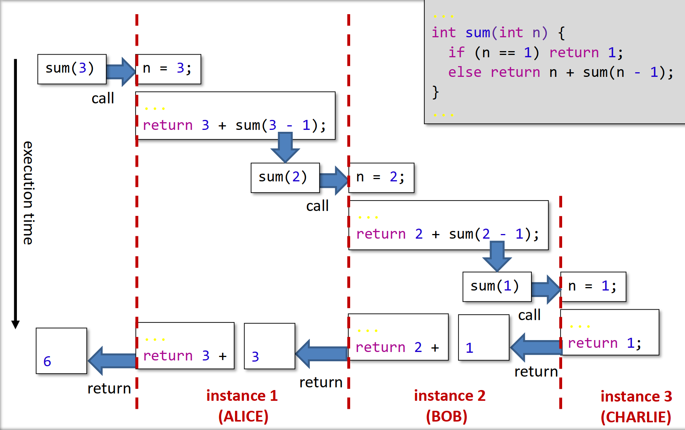

# 00.1 - Introduction

- gcc not deterministic!
- 5 hrs / week of programming practice self study + 5-6 in labs


## resources

- use provided unit tests for C
- use sample / tutorial code for formative coursework


## exams

- Sumative: 80% exam + 2x 10% mini coursework
- coursework split in half: closed & open ended tasks


## what is C

C is imperative & procedural

Imperative: telling the computer <u>how</u> to do things. using statements to define and change the state of the computer

Procedural: sequences are structures in small reusable chunks called <u>procedures</u>

### Functions

$ f: X,\ Y \rightarrow Z $

$ f(x, y) = x+y $

``` C
int f(int x, int y) {
    return x + y;
}
```

- think: what does it do / achieve?

### procedures

a pure function calculates its result using <u>only</u> its arguments e.g. f

C is procedural; programs are made of procedures

procedures _can_ take arguments and return a result

- think: what is it doing to the state?

### examples:

Within a month: 

``` C
signed char a = 64, b = 8, c = 2, result;
result = (a * b) / c;
printf("%hhi\n", result);
// actually prints 0, why?
```

``` C
int a = -1;
unsigned int b = 1;
if (a > b) printf("a > b");
// actually prints a > b, why?
```

``` C
unsigned short w = 0x00FF;
unsigned char *b = &w;
printf("%hhu,%hhu\n", b[0], b[1]);
// actual output depends on computer model, why?
```

In two months:

``` C
int i = 3, *p = &i, **q = &p;
int *w[] = {p, &i, *q};
int *(*z)[] = &w;
printf("%p %d\n", (*z)[0], *(*z)[0]);
// what does the code snippet print, why?
```

By the end of the course:

``` C
bool r = false;
bool *q = &r;
signal(SIGINT, yourFunctionPointer);
const bool volatile qu = false;
__asm__ ("nop\n" : "=a" (q) : "a" (&qu));
while (!quit) {
raise(SIGINT);
} // does volatile influence execution, why?
```


# 01.1 - Procedures & Programs

Simplest possible program

```C
int main(void) {
    return 0;
}
```

build settings:
```
gcc -std=c11 -Wall *.c -o *.out && ./*.out
```

## compilation

- syntack checked
- semantics _not_ checked, it is impossible; halting problem
- compiled binaries are system specific

### Libraries

in a `#include` call putting angle brackets arround the library tell the compiler to look in the "standard place" (`/usr/include/`) and double quotes tell it to go to a specific path

## 01.2 - Types, Variables, and Scope

variadic functions have a _varied_ number of arguments

- variables are not initialised to 0
- strongly typed

- a **platform** is a combination of processor, OS, dirvers, libraries, compiler, runtime, versions, and settings. This is the environment
    - this is why contanerisation is usefull, it abstracts away the environment

### Types

- the properties of each type may differ on different platforms
    - int is _usualy_ 32 bits
    - long is _usualy_ 64 bits

## Input

```C
int length
scanf("%d", &length)
// there are better ways to do this
```

# 01.3 Decisions & Recursion

## Relational Expressions

- can be evaluated true or false
```C
              0 //false
       (0 || 1) //true
      (15 < 18) //true
((15 + 4) < 18) //false
           (37) //true
          (!21) //false
((1 – 1) && 21) //false
     (11 != 11) //false
((1 – 1) || 11) //true
 ((1 – 1) == 0) //true

        (x = 5) //usually a bug, but true
        (x = 0) //usually a bug, but false
```
## Scope

>[!IMPORTANT]
> avoid global variables at all costs

the scope of variables are the block in which they are defined, or any blocks defined within.

## Tracing

Tracing variables can be very helpful. Either mentaly, with pen & paper, or a debugger like gdb.

```C
                            // x y min return value
int minimum(int x, int y) { // 7 8 n/a ?
int min;                    // 7 8 ?   ?
if (x < y) min = x;         // 7 8 7   ?
else min = y;               // 7 8 7   ?
return min;                 // 7 8 7   7
}
```

## Conditional chains
```C
/* Transform mark into grade. */
int grade(int mark) {
int grade;
if (mark >= 70) grade = 1;
else if (mark >= 50) grade = 2;
else if (mark >= 40) grade = 3;
else grade = 4;
return grade;
}
```

you can use decision trees to represent them

## Prototypes

Foreward decleration, says what but not how
```C
...
int grade(int mark); // declaration of signature only
...
int main(void) { ...
grade(mark)); ...
}
...
int grade(int mark) { ... } // full definition with body
```

## Shadowing

- identifier clash

when a variable is given the same name as another from a scope above it, the innermost variable is used. the other is not overwritten.
```C
int a = 7;
{
    int a = 12;
    printf("%d", a); // will print 12
}
printf("%d", a); // will print 7
```

if it is within the same scope this is not allowed (except for overloading)

```C
// not allowed
int a = 7;
float a = 3.5;

// allowed
void foo(int);
void foo(float);
```

if it is after the end of the scope it was first defined in, there is not a problem as the origional no longer exists.

```C
// no problem
{
    int a = 5;
}
float a = 3.13;
// the first a is out of scope so its fine
```


## Switch statements

```C
int nextHailstone(int x) {
    int next;
    switch (x % 2) {
        case 1: next = 3 * x + 1; break;
        case 0: next = x / 2; break;
        default: return -1 // something has gone wrong
    }
    return next;
} 
```

you must break, or excecution will fall through to the next case. the default case is optional and must be the last one

## Recursion

self referential functions

```C
// Find the sum of the numbers from 1 to n.
int sum(int n) {
    if (n == 1) return 1;
    else return n + sum(n - 1);
}
```


each call a frame is pushed to the stack

## 4 laws of Programs

0. programs must **work correctly**
1. must be **readable**
2. must be **compact**
3. must be **efficient**

- avoid exiting loops early
    - using a break statement
    - returning from within a loop
    - using continue

- avoid do while loops

- **Never usa a goto**

# 02.3 - Arrays

the size of an array is always constant

## Initialisation

> [!CAUTION]
> you can get silent out of bounds errors, if the invalid address is within your allocated memory segment, this means it does not throw a segfault but still accesses invalid memmory

- arrays are allocated to the stack, which is limited in size.

if at least 1 value is specified, any non-specified elements are initialised to 0

```C
int sequence1[3] = {2, 3, 5} // -> {2, 3, 5}
int sequence2[6] = {2, 3, 5} // -> {2, 3, 5, 0, 0, 0}
int sequence3[100] = {0} // -> {0, 0, ..., 0}
// be carefull, only the first element is 1
int sequence4[100] = {1} // -> {1, 0, ..., 0}

// the compiler can also infer the size of the array from the initialiser list
int sequence5 = {2, 3, 5, 7, 11} // -> {2, 3, 5, 7, 11} (5 elements)
```

you can have a variable length array, where the size is constant but not known at compile-time.
```C
    int calculate(int noElements) {
    int seq[noElements]; // declare array of length noElements
    ...
}
```

## Passing Arrays

arrays are passed by reference, not value

when a function has an array as a parameter `int sum(int array[])` something called pointer decay happens, where the function definition becomes `int sum(int *array)`

## 2d arrays

each sub-array is contiguous within the main array, so a 2 by 3 matrix is identical to a 6 element array. They are _not_ implemented as an array of pointers to arrays. C is **row-major** where the first index value has the most significance

# 03.1 - Strings

C has no strings, they are just arrays of (ASCII) characters

- `\0` represents the null character

## non ASCII characters

C uses UTF-8 for other characters

## Initialising

```C
char textA[3] = {'H', 'i', '\0'}; // a string: must include '\0'
char textB[]  = {'H', 'i', '\0'}; // size inferred: 3
char textC[3] = "Hi";             // shortcut: adds the '\0'
char textD[]  = "Hi";             // shortcut + size inferred
```

## string.h

`strlen()` retruns the length of a string, the null character is not counted

it returnts a `size_t` so trying to print it with `%d` is wrong, by doing it the number is automatically converted (coerced) to an int, the correct specifier is `%zu`

it also provides:
- `strcmp` check if strings are equal
    - returns 0 if they are the same
    - < 0 if the first string comes before the second one alphabeticaly
    - finds the numerical difference in the ASCII values
- `strcpy` copy a string to another array
    - copies the null terminator
    - can go out of bounds if the second string is not big enough
- `strcat` concatenate strings
    - copies the second string onto the end of the first `s1 = s1 + s2`
- `sprintf` builds messages similar to python f-strings
    - printf but puts the result into a string rather than the stream


